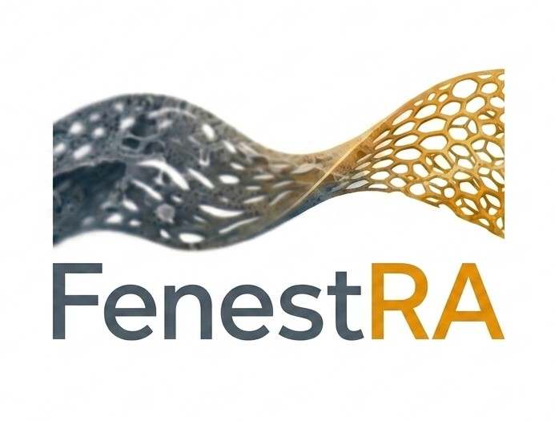

<p align="center">
  
</p>

# FenestRA
**Fenestration Resolution & Analysis Pipeline**


FenestRA is a custom Napari plugin built for the Advanced LSEC AFM Pipeline. It bridges the gap between interactive Napari features, legacy deep-learning upscale repositories via Apptainer, and state-of-the-art Cellpose instance segmentation. 

By combining Deep Learning-based Super Resolution (HAT / SwinIR) with automated morphological analysis, FenestRA drastically simplifies the workflow of extracting robust physical porosity and fenestration morphology metrics directly from raw `.jpk.qi-image` files.

---

## 🚀 Features
- **Hub-and-Spoke Deep Learning Architecture:** Run legacy Python 3.8 dependent upscale models asynchronously inside a Singularity container without freezing your modern Napari GUI.
- **Native JPK Ingestion:** Automatically reads native physical scale (`nm / px`) from `.jpk.qi-image` files using AFMReader.
- **Synchronized 4-Pane Analysis:** Auto-generates a synchronized Napari viewer layout combining Raw, Upsampled, Mask, and Boundary Overlays natively.
- **Configurable Fallbacks:** Includes high-fidelity Python-based CLAHE and unsharp masking functions when DL inference isn't required.
- **Sub-cellular Quantification:** Automatically calculates standard metrics + digital-to-physical size translations directly to a `.csv`.

---

## 🛠 Installation

### 1. Requirements
Ensure you have `Apptainer` or `Singularity` installed on your system to run the Super-Resolution container logic.

### 2. Create the Host Environment
Create a clean Anaconda environment optimized for Cellpose targeting CUDA 12.4:

```bash
conda create -n fenestra-env -c conda-forge python=3.10 numpy=1.26.4
conda activate fenestra-env

# Install base GUI tools, Napari, and core scientific dependencies
pip install "napari[all]" magicgui qtpy scipy scikit-image pandas tifffile "numpy<2"

# Install PyTorch mapped explicitly to CUDA 12.4 to ensure GPU hardware acceleration works
pip install --index-url https://download.pytorch.org/whl/cu124 torch==2.4.0 torchvision==0.19.0

# Install Cellpose for fenestration instance segmentation
pip install cellpose

# Install AFMReader for handling raw JPK AFM metadata
pip install git+https://github.com/AFM-SPM/AFMReader.git
```

### 3. Install FenestRA
Clone this repository and install it in "editable" mode:
```bash
git clone https://github.com/LIVR-VUB/FenestRA.git
cd FenestRA
pip install -e .
```

---

## 🎯 Usage

1. Activate your environment: `conda activate fenestra-env`
2. Launch napari: `napari`
3. Navigate to `Plugins > FenestRA Pipeline` to open the widget!
4. **Step 1:** Load your `*.jpk-qi-image` file.
5. **Step 2:** Select an upsampling method. If using HAT/SwinIR, pick your Model `.pth` and Singularity `.sif` container and hit Run. Wait for the background thread to finish.
6. **Step 3:** Setup Cellpose parameters. If using automatic cluster diameter estimation, set Diameter to `0`. Hit Run Cellpose.
7. **Step 4:** Arrange grid for 4-pane layout reviewing, and click **Quantify Fenestrations** to export your CSV metrics!
