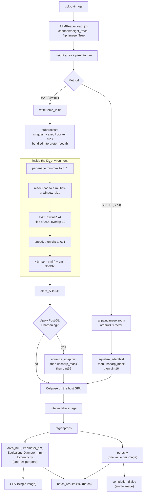

# Dataflow

This page follows one scan from the `.jpk-qi-image` file to the exported metrics, naming the dtype and value range of the array at each stage. Read it when you need to know what a number in the output actually represents.

## The whole pipeline

Porosity is not a column of the single-image CSV. For a single image it appears only in the dialog that opens after the export (`_widget.py:549`), while the batch workbook carries it as a `Porosity` column repeated on every row of that image (`pipeline.py:512`).

## Stage by stage

### 1. Load

`process_jpk` calls `load_jpk(file_path=..., channel="height_trace", flip_image=True)` and returns two things: the 2D height array and `pixel_to_nm`, the lateral size of one pixel in nanometers (`pipeline.py:57-62`). The array is passed on unchanged. `pixel_to_nm` is stored and is next used only at the quantification step, to convert pixel measurements into nanometers.

### 2a. CLAHE branch

`upsample_clahe` casts to `float64`, runs `scipy.ndimage.zoom` with `order=3` (bicubic) at the Factor you set, then hands the result to `apply_post_processing` (`pipeline.py:82-86`). That function min-max normalizes to 0..1, applies `equalize_adapthist` with `nbins=256`, applies `unsharp_mask`, multiplies by 65535 and casts to `uint16` (`pipeline.py:69-79`).

The output is a `uint16` contrast-equalized image. It is no longer in height units, and it never went through the deep-learning branch.

### 2b. Deep-learning branch

The host writes the raw array to `temp_in.tif` and starts `inference.py` in the deep-learning environment — a container under the Singularity and Docker engines, a second interpreter on the same filesystem under the Local engine (see [Containers](containers.md)). Inside `inference.py`:

| Line | What happens |
|---|---|
| `:97` | `tifffile.imread(...).astype(np.float32)` |
| `:98` | `vmin, vmax = img.min(), img.max()` are recorded |
| `:106` | `img_norm = (img - vmin) / (vmax - vmin)`, giving exactly 0..1 |
| `:114-118` | reflect-pad the right and bottom edges to a multiple of `window_size` (16 for HAT, 8 for SwinIR) |
| `:122-124` | tiled inference, because the host always passes `--tile_size 256` |
| `:131-134` | crop the padding back off, at 4x its input size |
| `:138` | `np.clip(out_npy, 0, 1)` |
| `:141` | `out_restored = out_npy * (vmax - vmin) + vmin` |
| `:143` | write `float32` to `{input_stem}_SR4x.tif` |

The result the host reads back is `float32` in the same physical height range as the input scan.

### 3. Optional sharpening

If **Apply Post-DL Sharpening** is ticked, the host runs the same `apply_post_processing` used by the CLAHE branch on the deep-learning output. That converts the array from `float32` in height units to `uint16` normalized to 0..65535.

!!! warning "The same filename means two different things"
    In a batch run, `<image_stem>_upsampled.tif` is `float32` height data when the checkbox is off and `uint16` normalized data when it is on. Nothing in the filename or in `batch_results.xlsx` records which. If you plan to measure heights off those TIFFs, note the checkbox state in your own records.

### 4. Segmentation

Cellpose runs on the host GPU against whichever array came out of step 2 or 3. The call uses `normalize={"normalize": True, "percentile": (1.0, 99.0)}`, `min_size=15`, `do_3D=False`, `augment=False` (`pipeline.py:246-257`). The output is an integer label image at the upsampled resolution, with 0 for background and one label per detected pore.

### 5. Measurement

`regionprops` runs on the label image, and each pixel measurement is multiplied by `upsampled_scale_nm = pixel_to_nm / upsample_factor` (`pipeline.py:509`, `_widget.py:542`). See [Metrics](../reference/metrics.md) for the column definitions and [Outputs](../reference/outputs.md) for the files.

## Array dtypes and ranges

| Stage | dtype | Range |
|---|---|---|
| Loaded from the JPK | as returned by AFMReader | physical height |
| Read inside the DL environment | `float32` | unchanged |
| After min-max normalization | `float32` | exactly 0 to 1 |
| Model output, before the clip | `float32` | can fall outside 0 to 1 |
| After `np.clip(0, 1)` | `float32` | 0 to 1, tails removed |
| After the rescale | `float32` | `vmin` to `vmax` of the input scan |
| `_SR4x.tif` written by `inference.py` | `float32` | physical height |
| CLAHE output, or DL output with sharpening | `uint16` | 0 to 65535, no height units |
| Cellpose masks | integer labels | 0 is background |

## Normalization: what goes in is not what was trained on

Two details here decide what Cellpose sees, so they are worth stating plainly.

**On the way in**, `inference.py:106` applies a per-image min-max stretch to exactly 0..1. The models were trained under a percentile normalization (0.1 to 99.9) that deliberately did not clip. In the training set of 130 scans, all 130 exceeded 1.0 and 124 went below 0.0 after that transform. A min-max stretch is a different transform, and one bright speck in your scan rescales the whole image.

**On the way out**, `inference.py:138` clips to 0..1 before restoring the physical height range. That removes precisely the tails the network was trained to produce. Pore rims are where those tails live, so the effect lands on the boundary Cellpose then segments and on the diameter that `regionprops` then measures.

Neither step raises an error. Both are why [The Scale Domain](../caveats/scale-domain.md) matters more here than it would for a picture you only look at.

## Tiling and seams

The host always passes `--tile_size 256` — the `DL_TILE_SIZE` constant at `pipeline.py:100`, written into the argv for every engine — so tiled inference runs even on images that would fit in GPU memory whole. `tile_inference` uses `overlap = 32` and therefore a stride of 224 (`inference.py:149-150`).

The blend across the overlap is a boxcar average, not a feathered one. Each tile's full output is added into an accumulator, a coverage counter is incremented over the same rectangle, and the accumulator is divided by the counter at the end (`inference.py:181-184`). Every pixel in the overlap gets an unweighted mean of the tiles covering it, with a hard edge where the coverage count changes. Seams at a 224-pixel input pitch are possible.

!!! warning "Do not read fine periodic texture as biology"
    Two non-biological sources of periodic structure exist in a FenestRA output: the tile grid described above, and HAT's 16-pixel window partition, which is known to leave a periodic fingerprint of its own. Regular texture at those pitches is an artifact of the reconstruction, not a feature of the membrane.

## The DL call

Since 0.3.0 there is one argv builder for every engine and every path. `_build_dl_cmd(engine, temp_in_path, temp_out_dir, container_path, model_path, architecture)` (`pipeline.py:109-165`) returns an `(argv, env)` pair, and `_run_dl_inference` (`pipeline.py:168-189`) runs it, raises on a non-zero return code and returns the first `*.tif*` it finds in the output directory. Both callers go through it: the `@thread_worker` generator `run_dl_upsampling` used by the interactive panel (`pipeline.py:192-211`) and `run_dl_upsampling_sync` used by the batch loop (`pipeline.py:323-339`). The engine label is reduced to its first word by `_engine_key` (`pipeline.py:103-106`), so "Local (bundled)" becomes `local`.

The three branches differ only in how the script and its files are reached:

| Engine | argv | Files |
|---|---|---|
| Singularity | `singularity exec --nv --bind ... <sif> python /opt/dl_project/scripts/inference.py ...` (`pipeline.py:154-157`) | four bind mounts (`pipeline.py:137-142`) |
| Docker | `docker run --rm --gpus all -v ... <image> python /opt/dl_project/scripts/inference.py ...` (`pipeline.py:158-161`) | the same four, as `-v` |
| Local (bundled) | `<dl python> <site-packages>/fenestra/backend/inference.py ...` (`pipeline.py:123-130`) | real host paths, no mounts and no path translation |

Both container engines spell out `python` in front of the script (`pipeline.py:143-152`): `singularity exec` bypasses `%runscript`, and the Docker recipe carries no `ENTRYPOINT`. The Local engine needs no container at all, which is what lets the whole application ship as one image — a container cannot launch a container.

The Local interpreter is `/opt/venv-dl/bin/python` (`DEFAULT_DL_PYTHON`, `pipeline.py:98`), overridable with `FENESTRA_DL_PYTHON`. If that file does not exist the run stops with a message naming the path rather than failing deeper in (`pipeline.py:116-121`). `PYTHONPATH` and `PYTHONHOME` are stripped from the subprocess environment (`pipeline.py:134`); the GUI lives in a different virtual environment, and either variable would pull its numpy and torch into the deep-learning interpreter, which is the one thing two separate environments exist to prevent. The container engines inherit the environment unchanged, so `_build_dl_cmd` returns `None` for `env` there.

`tests/test_dl_cmd.py` asserts the shape of all three argvs and the scrub. Run it with `python tests/test_dl_cmd.py`.

!!! warning "The all-in-one image is not the reference stack"
    The Local engine is what the [all-in-one container](../install/all-in-one.md) uses, and its bundled deep-learning environment runs torch 2.1.2 / torchvision 0.16.2 in the standard image, or torch 2.8.0 / torchvision 0.23.0 in the `cu128` (Blackwell) image — neither is the torch 1.14 of `nvcr.io/nvidia/pytorch:23.01-py3` that `containers/dl_upsampling.def` still builds. The torch 1.13/1.14 wheels carry no PTX and will not start on a GPU newer than sm_86, so newer hardware has no other option. Numbers intended for publication should come from the reference container.

!!! note "Before 0.3.0"
    The container argv was written out twice, byte for byte, once for the interactive path and once for the batch path. A change made in one block and not the other made batch results stop matching interactive ones with no error. If you are reading an older install, check both blocks.
