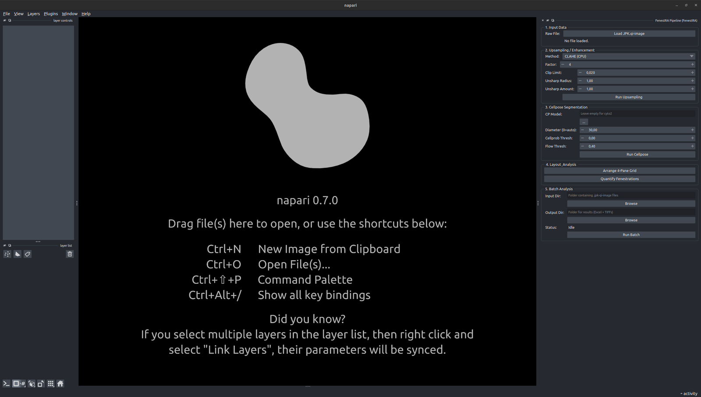

# User Guide

How to open FenestRA inside napari, and what each of the five numbered panels does. Each panel has its own page with a screenshot of the real interface.

## Opening the plugin

Activate the environment you installed FenestRA into, then start napari:

```bash
conda activate fenestra-env
napari
```

In napari, choose **Plugins → FenestRA Pipeline**. The plugin opens as a dock on the right-hand side of the window.



The dock is taller than most screens, and it has no scrollbar: whatever does not fit is clipped rather than scrollable. To reach the lower panels, enlarge the napari window, drag the dock's left edge to widen it, or double-click the dock's title bar to float it as a resizable window of its own.

If **FenestRA Pipeline** is not in the Plugins menu, napari has not picked the package up. See [Verify your install](../install/verify.md).

## The five panels


| Panel | What it does | Page |
|---|---|---|
| **1. Input Data** | Loads a `.jpk-qi-image` and reads its size and physical scale in nm/px. Adds the `Raw AFM` layer. | [1 - Input data](step1-input.md) |
| **2. Upsampling / Enhancement** | Enlarges the scan, either with CLAHE on the CPU or with a trained HAT/SwinIR model in a container. Adds the `Upsampled AFM` layer. | [2 - Upsampling](step2-upsampling.md) |
| **3. Cellpose Segmentation** | Finds the fenestrations in the upsampled image and produces a label mask. Adds the `Cellpose Masks` layer. | [3 - Segmentation](step3-segmentation.md) |
| **4. Layout & Analysis** (the app draws this title as `4. Layout_Analysis`, because Qt takes the ampersand as a keyboard mnemonic) | Arranges a 2×2 comparison grid, and exports the per-pore measurements to CSV. | [4 - Layout & analysis](step4-analysis.md) |
| **5. Batch Analysis** | Runs the whole pipeline over a folder of scans and writes a consolidated workbook. | [5 - Batch analysis](step5-batch.md) |

## Order matters

Work the panels top to bottom. Each one consumes what the one above it produced, and the plugin will stop you if something is missing:

- **Run Upsampling** without a loaded file gives you "Please load an image first."
- **Run Cellpose** without an upsampled image gives you "Please run upsampling first (or load one natively)."
- **Quantify Fenestrations** without both a loaded JPK and a mask gives you "Requires JPK loaded and Segmented Masks."

Running a step again replaces its layer rather than adding a second one, so you can retune a threshold and re-run without cleaning up the layer list.

!!! note "Panel 5 borrows from panels 2 and 3"

    The batch runner has no settings of its own beyond the input and output folders. It reads the method, the factor, the sharpening parameters, the model and engine fields, and every Cellpose control straight from panels 2 and 3 at the moment you press **Run Batch**. Set those up, ideally test them on one image first, and only then run the batch.

## A first pass on one image

A reasonable way to start, using no model weights at all:

1. Panel 1: load a scan. Read the **Scale** value in the info label.
2. Panel 2: leave the method on `CLAHE (CPU)` and press **Run Upsampling**.
3. Panel 3: press **Run Cellpose** with the default thresholds.
4. Panel 4: press **Arrange 4-Pane Grid** to see whether the mask sits on the pores, then **Quantify Fenestrations** to export.

CLAHE is interpolation and contrast enhancement, not super-resolution, so this pass tells you the mechanics work rather than giving you publishable resolution. What the numbers do and do not support is covered in [Caveats & limits](../caveats/index.md).
