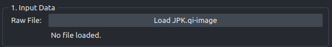

# 1 - Input data

Loading a raw AFM scan and reading its physical scale. This is the only panel that touches the microscope file, and the scale it reads here is what turns every later measurement into nanometers.



## Loading a scan

Press **Load JPK.qi-image** next to `Raw File:`. The file dialog is filtered to `JPK Files (*.jpk *.jpk-qi-image)`, so both the quantitative imaging format and plain `.jpk` files are offered.

Once the file opens, the info label underneath the button fills in with two lines:

```text
Size: (1024, 1024)
Scale: 100.00 nm/px
```

- **Size** is the pixel dimensions of the scan as (height, width).
- **Scale** is the physical size of one pixel in nanometers, read out of the file's own metadata.

A layer named `Raw AFM` appears in the viewer with the `magma` colormap. Loading a second file removes the previous `Raw AFM` layer rather than stacking on top of it.

If the file cannot be read you get a dialog headed "Error" containing "Could not load JPK:" and the underlying message. The usual cause is that AFMReader is missing from the environment. See [Verify your install](../install/verify.md).

## Read the scale before you go further

The **Scale** value is not decoration. Two things depend on it:

1. **Every physical number in your results.** Area, perimeter, and equivalent diameter are all computed as pixel counts multiplied by the output pixel size, which is this value divided by the upsampling factor. The arithmetic is in [Metrics](../reference/metrics.md).

2. **Whether the deep learning models apply to your scan at all.** The HAT and SwinIR models were trained to invert a ×4 degradation from data whose low-resolution side sits near 100 nm/px. A scan acquired at around 25 nm/px is already four times finer than anything the network saw in training. Nothing in the plugin checks this, nothing warns, and the output still looks like a plausible AFM image.

!!! warning "Check the scale against the training domain now"

    Acquire at roughly 100 nm/px so the ×4 output lands near the ~25 nm/px domain the models were trained on. If your **Scale** reads far outside that band, the deep learning result is out of domain and the diameters it produces are not supported by the training data. Read [The scale-domain question](../caveats/scale-domain.md) before you rely on the numbers.

    This does not apply to the `CLAHE (CPU)` method, which involves no trained model.

??? note "Which channel is read, and how it is oriented"

    `process_jpk` calls AFMReader with `channel="height_trace"` and `flip_image=True`, which flips the array vertically as it is read, and returns the array together with the nm/px scale. There is no channel selector in the interface: retrace, error, and adhesion channels are not accessible from the plugin.

## Next

Panel 2 decides how the scan is enlarged. Go to [2 - Upsampling](step2-upsampling.md).
