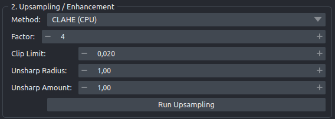

# 2 - Upsampling

Enlarging the loaded scan so that Cellpose has enough pixels per pore to segment. This panel offers one method that runs on your CPU and needs nothing extra, and two that run a trained super-resolution model inside a container.

## Choosing a method

| Method | What it is | Factor | Needs |
|---|---|---|---|
| `CLAHE (CPU)` | Cubic interpolation, then contrast equalization, then unsharp masking | 1 to 10, you choose | Nothing beyond the host environment |
| `HAT` | Trained HAT super-resolution model | Always ×4 | Container backend and a `.pth` checkpoint |
| `SwinIR` | Trained SwinIR super-resolution model | Always ×4 | Container backend and a `.pth` checkpoint |

**`CLAHE (CPU)` is not super-resolution.** It enlarges the array with cubic interpolation (`scipy.ndimage.zoom`, order 3), applies contrast-limited adaptive histogram equalization, and sharpens with an unsharp mask. No information is added that was not in the original scan. Use it to check that the rest of the pipeline works, and for any scan where you do not have applicable weights. It needs no GPU.

**`HAT` and `SwinIR` are the trained models.** They run at a fixed ×4 upscale, so the **Factor** box disappears when you select them. They require the container backend to be built and a checkpoint file on disk.

!!! important "The model weights are not public yet"

    The HAT and SwinIR checkpoints are released with the peer-reviewed manuscript. Until then these two methods only work if you already hold weights. See [Model weights](../install/model-weights.md). The `CLAHE (CPU)` method works today with no weights at all.

## Which controls appear

The panel hides controls that do not apply, so it looks different depending on the method:

| Control | `CLAHE (CPU)` | `HAT` / `SwinIR` |
|---|---|---|
| **Method** | shown | shown |
| **Factor** | shown | hidden |
| **Clip Limit**, **Unsharp Radius**, **Unsharp Amount** | shown | shown only when **Apply Post-DL Sharpening** is ticked |
| **DL Model**, **Engine**, **Apply Post-DL Sharpening**, container field | hidden | shown |
| **Run Upsampling** | shown | shown |

## Every control

| Control | Default | Notes |
|---|---|---|
| **Method** | `CLAHE (CPU)` | Also `HAT`, `SwinIR` |
| **Factor** | `4` | Whole numbers, 1 to 10. Ignored by HAT and SwinIR, which are always ×4 |
| **Clip Limit** | `0.020` | Contrast limit for the equalization, three decimals, arrow steps of 0.01. Higher means more aggressive local contrast |
| **Unsharp Radius** | `1.00` | Radius of the sharpening kernel in pixels of the enlarged image |
| **Unsharp Amount** | `1.00` | Strength of the sharpening |
| **DL Model** | a pre-filled path, see below | Path to a `.pth` checkpoint. The `...` button opens a `*.pth` file picker |
| **Engine** | `Singularity` | Or `Docker` |
| **Apply Post-DL Sharpening** | unticked | Runs the same equalization and sharpening on the model's output |
| **Singularity (.sif)** / **Docker Tag** | a pre-filled value, see below | Label and content change with the engine |

Before it starts a deep learning run, the plugin checks that **DL Model** points at a file that exists ("Model path is invalid." if not) and, for Singularity, that the container file exists ("Singularity container path is invalid.").

## The Engine dropdown

`Singularity` builds a `singularity exec --nv` command against a `.sif` file on disk, and the `...` picker lets you browse for it. This is the Linux and HPC path.

`Docker` builds a `docker run --rm --gpus all` command against an image tag, and the picker is hidden because a tag is not a file. This is the Windows and macOS path. Switching to Docker fills the field with `livrvub/dl-upsampling:latest`, which is a tag you build locally, not something published on Docker Hub. See [Container backend](../install/container-backend.md).

!!! warning "Switching back to Singularity overwrites what you typed"

    Selecting `Singularity` in the Engine dropdown replaces the contents of the container field with a fixed path, discarding anything you had entered. The same is true in reverse for Docker. Set the engine first, then fill in the path, and re-check the field if you ever toggle the dropdown.

    The two values it writes are developer paths from the machine the plugin was built on. **DL Model** and **Singularity (.sif)** both ship pre-filled with `/home/arka/Desktop/AFM-Project/DL_Upsampling/...`, which will not exist on your system. Replace both with your own paths.

!!! warning "Rebuild a Docker image built before September 2026"

    The Dockerfile used to declare `ENTRYPOINT ["python"]`, which made the container fail loudly before inference started and produced no output file. The line has been removed. An image built from an older checkout still carries it, so rebuild if you hit `can't open file '/opt/python'`. Details in [Known issues](../caveats/known-issues.md).

## Apply Post-DL Sharpening

Ticking this box runs the model output through the same contrast equalization and unsharp mask that `CLAHE (CPU)` uses, with the **Clip Limit**, **Unsharp Radius**, and **Unsharp Amount** values from this panel. Ticking it also reveals those three controls, which are otherwise hidden for the deep learning methods.

It can make pore rims easier for Cellpose to find. It also changes what the image is.

!!! warning "Sharpening changes the units of the output"

    Without sharpening, the upsampled image is **float32 in physical height units**: the model output is rescaled back to the minimum and maximum of your input scan.

    With sharpening, the image is normalized to 0 to 1 and rewritten as **uint16**. The height information is gone; only the relative pattern remains.

    Nothing in the filename, the layer name, or the batch workbook records which of the two you produced. If you plan to measure heights off a saved `_upsampled.tif`, leave this box unticked. If you tick it, note the fact in your own records.

    Pore areas, perimeters, and diameters are unaffected, because those are measured from the Cellpose mask in pixels and converted using the scale, not from the intensity values.

## Running it

Press **Run Upsampling**. The button changes to "Upsampling in progress..." and is disabled until the run finishes.

Deep learning runs happen in a background thread that calls out to the container, so napari stays responsive and you can pan and zoom while it works. If the container exits non-zero you get a dialog headed "DL Error" containing "Container DL Inference failed:" followed by the container's own error output. That text is the useful part; see [Troubleshooting](../caveats/troubleshooting.md).

!!! note "CLAHE will freeze the window, briefly"

    The `CLAHE (CPU)` path runs on the interface thread. On a large scan at a high factor, napari stops redrawing and the operating system may gray the window out or offer to force-quit it. It is working, not crashed. Wait for it.

## The result

A layer named `Upsampled AFM` is added with the `magma` colormap and `scale=(0.25, 0.25)`. That scale shrinks each of its pixels to a quarter of a raw pixel, so the enlarged image overlays the raw scan at the same physical size. Re-running replaces the layer.

!!! warning "The display scale assumes ×4"

    That `0.25` is hardcoded. It is correct for HAT and SwinIR, which are always ×4, and correct for CLAHE at factor 4. At any other CLAHE factor the upsampled layer is drawn at the wrong physical size relative to `Raw AFM`, and the 4-pane grid in panel 4 will show them misaligned while looking plausible. This affects the display only. It does not change the exported measurements, which use the factor separately. See [Known issues](../caveats/known-issues.md).

??? note "What happens inside the container"

    The raw array is written to a temporary `.tif`. The plugin then runs `inference.py` inside the container with four bind mounts, at a tile size of 256. Inside, the image is normalized per-image to [0, 1] by its own minimum and maximum, reflect-padded up to a multiple of the model's window size, pushed through the network in overlapping 256-pixel tiles, unpadded, clipped back to [0, 1], and rescaled to the original height range. The result is written as float32 to `<name>_SR4x.tif`, which the plugin reads back into the viewer.

    Two consequences worth knowing: the per-image min-max normalization means one bright speck rescales the whole scan, and the clip to [0, 1] truncates the tails the network was trained to produce. Both are discussed in [The scale-domain question](../caveats/scale-domain.md).

!!! note "SwinIR fails on some image heights"

    With SwinIR, a small set of image heights makes the tiling raise `RuntimeError: Padding size should be less than the corresponding input dimension`. Common square sizes (256, 512, 1024, 2048) are unaffected, and the failure is loud rather than silent. Details in [Known issues](../caveats/known-issues.md).

## Next

Panel 3 segments the layer you just produced. Go to [3 - Segmentation](step3-segmentation.md).
