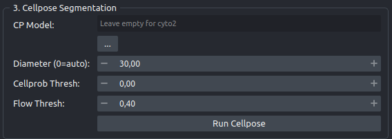

# 3 - Segmentation

Finding the fenestrations in the upsampled image with Cellpose, and producing the label mask that everything downstream is measured from. Two of the controls in this panel do not do what their names suggest, so read the Cellpose 4 section before you tune anything. Their labels were corrected in 0.3.0; what they do did not change.

Cellpose runs on the host, in your napari environment, on the GPU if one is available. It does not use the container. It segments the `Upsampled AFM` layer, so what gets found depends on which upsampling method you ran.

## The controls

| Control | Default | Range | Effect |
|---|---|---|---|
| **CP Model** | empty, or whatever `FENESTRA_CP_MODEL` is set to (`_widget.py:32`) | any file | Path to a trained Cellpose checkpoint. An empty field, or any path that does not exist on disk, falls back to the built-in default. The `...` button opens an unfiltered file picker |
| **Diameter (30 = no rescale)** | `30.00` | 0 to 500 | Not a diameter in pixels. See below |
| **Cellprob Thresh** | `0.00` | -10 to 10, steps of 0.1 | How confident Cellpose must be that a pixel belongs to an object |
| **Flow Thresh** | `0.40` | 0 to 10, steps of 0.1 | How consistent an object's predicted flows must be for it to be kept |

Press **Run Cellpose**. The button reads "Segmenting..." while it works, in a background thread, so napari stays responsive. Errors arrive in a dialog headed "Cellpose Error".

## Cellpose 4 reinterprets two of these controls

The interface was written against Cellpose 2. The installed version is Cellpose 4, which reinterprets both **CP Model** and **Diameter**. The behavior below was verified against cellpose 4.1.1 and is what the code still does.

!!! info "What 0.3.0 changed here: the labels, not the behavior"

    Up to 0.2.11 the CP Model placeholder read `Leave empty for cyto2` and the diameter row was labeled `Diameter (0=auto)`. Both described Cellpose 2. 0.3.0 rewrote them to `Leave empty for the Cellpose 4 default (cpsam)` (`_widget.py:193`) and `Diameter (30 = no rescale)` (`_widget.py:208`), and dropped the ignored `model_type="cyto2"` argument from both Cellpose calls (`pipeline.py:244` and `pipeline.py:369`). `setup.cfg` now pins `cellpose>=4.0.1` as a hard floor, because a constructor with no `model_type` has no model to load on Cellpose 2 or 3.

    Segmentation results are identical before and after. An empty box still gives cpsam, diameter 0 and 30 are still the same setting, and there is still no automatic diameter. If you are on an older install and the labels still say `cyto2` and `0=auto`, the two warnings below describe your version too.

!!! warning "An empty CP Model field, or a path that does not exist, gives you cpsam, not cyto2"

    The plugin tests whether the path in the field exists on disk (`pipeline.py:224`, `pipeline.py:356`), and when it does not, it constructs `CellposeModel` with no checkpoint, which loads **cpsam**, the Cellpose-SAM default. Up to 0.2.11 it asked for `model_type="cyto2"` at that point; Cellpose 4 accepted the argument, logged "model_type argument is not used in v4.0.1+. Ignoring this argument...", and loaded cpsam anyway. The model you get is the same either way.

    Nothing fails, and nothing distinguishes a deliberate empty box from a mistake. The same fallback catches a mistyped path or a checkpoint that has been moved or renamed: there is no "file not found" dialog and the run continues on cpsam. If you need a specific model, point **CP Model** at its checkpoint file explicitly, then check the napari console, which prints `>>>> loading model <path>` only when a checkpoint is actually loaded.

!!! warning "Diameter is a rescale factor, not a size in pixels"

    Cellpose 4 uses the value as `image_scaling = 30 / diameter`. It does not describe how big your pores are.

    - **30** (the default) gives a scaling of 1.0, which is no rescale at all.
    - **0** fails Cellpose's `> 0` test and also produces no rescale. **0 and 30 are the same setting.**
    - **Below 30** upscales the image before segmentation, which makes small pores easier to find and the run slower.
    - **Above 30** downscales the image before segmentation, which is faster and loses the smallest pores.

    There is no automatic diameter estimation in Cellpose 4. Nothing measures your pores for you at any setting of this box; treat it as a zoom control and change it only if the default misses your pore size class.

## Settings you cannot change from the interface

Both the interactive and the batch segmentation calls hardcode these (`pipeline.py:246-257` and `pipeline.py:371-382`):

| Setting | Value | Consequence |
|---|---|---|
| `normalize` | `{"normalize": True, "percentile": (1.0, 99.0)}` | The 1st and 99th percentiles are recomputed **for each image**, so contrast is stretched independently per scan |
| `min_size` | `15` pixels | Objects smaller than 15 pixels in area are discarded |
| `do_3D` | `False` | 2D segmentation only |
| `augment` | `False` | No test-time augmentation |
| `channels`, `channel_axis` | `None` | Single-channel grayscale input |

### What min_size means in nanometers

An area of 15 pixels corresponds to an equivalent diameter of about 4.4 pixels. Converted to physical size, that floor moves with your output pixel scale:

| Input scale | Output scale after ×4 | Smallest pore kept |
|---|---|---|
| 25 nm/px | 6.25 nm/px | ~27 nm |
| 50 nm/px | 12.5 nm/px | ~55 nm |
| 100 nm/px | 25 nm/px | ~110 nm |

At 100 nm/px input the floor sits inside the biological size range for fenestrations, so the smallest pores are removed before you ever see them. Take this into account when you report a size distribution, particularly the lower tail.

!!! note "Per-image normalization matters most in batch"

    For a single image the per-image contrast stretch is harmless. Across a folder of scans it means each image was segmented under its own contrast, so pore counts and porosities in one workbook are not strictly comparable to each other. See [5 - Batch analysis](step5-batch.md).

## Tuning the thresholds

Start from the defaults, change one control at a time, and use **Arrange 4-Pane Grid** in panel 4 to look at the mask over the image rather than judging from the mask alone.

**Cellprob Thresh** (default 0.00) controls how much of each object is accepted.

- Lower it, toward negative values, if pores are being missed entirely or if the masks are visibly smaller than the dark pore interiors. This admits dimmer, lower-confidence pixels and grows the masks.
- Raise it if background texture is being labeled as pores, or if adjacent pores are merging into one object. This shrinks the masks and drops marginal ones.
- Steps of 0.5 are usually enough to see a difference. Values beyond about ±6 are rarely useful.

Because area and diameter are measured directly off these masks, moving Cellprob shifts your reported pore sizes systematically. Fix it on a representative image and keep it constant across a study.

**Flow Thresh** (default 0.40) controls how irregular a shape is allowed to be.

- Lower it, toward 0.3, to reject objects whose shape is inconsistent with a coherent pore. This is the right direction for fenestrations, which are close to circular, and cleans up ragged fragments.
- Raise it, toward 0.6 or above, if genuine pores are being discarded because the image is noisy. This accepts more objects, some of them misshapen.

If a change to Flow Thresh produces no change in the mask, the objects it would filter are not being generated in the first place, and Cellprob is the control to move.

## The result

A labels layer named `Cellpose Masks` is added, drawn at a hardcoded `scale=(0.25, 0.25)` (`_widget.py:487`) so it sits on top of `Upsampled AFM`. Each fenestration gets its own integer label, and every label becomes one row in the exported table. Re-running replaces the layer.

Look at the mask before you export. Panel 4 measures exactly what Cellpose produced, including anything it labeled that is not a pore.

## Next

Panel 4 compares the layers and exports the numbers. Go to [4 - Layout & analysis](step4-analysis.md).
