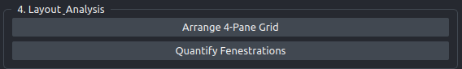

# 4 - Layout & analysis

Two buttons: one arranges the layers into a comparison grid, the other computes the physical measurements and writes them to CSV. Read the warning about the Method dropdown before you press the second one.



## Arrange 4-Pane Grid

Builds a composite layer and switches napari from stacked view to a 2×2 grid, then resets the view so everything is in frame.

The composite is called `Overlay`. It is an RGB image: the upsampled scan converted to 8-bit grayscale, with the inner boundary of every Cellpose label drawn in red on top. It is the fastest way to see whether the mask actually sits on the pores or has drifted onto texture.

The four panes are, in layer order:

| Pane | Layer | Drawn at |
|---|---|---|
| 1 | `Raw AFM` | scale 1 |
| 2 | `Upsampled AFM` | scale 0.25 |
| 3 | `Cellpose Masks` | scale 0.25 |
| 4 | `Overlay` | scale 0.25 |

Napari's grid shows every layer in the viewer, so if you have added layers of your own you will get more than four panes. Remove them first if you want the intended layout.

The `Overlay` layer is only built when both an upsampled image and a mask exist. Pressing the button earlier still switches the viewer to grid mode, with fewer panes to fill.

!!! note "Panes 2 to 4 assume ×4"

    The three upsampled panes are drawn at a hardcoded quarter scale. If you ran CLAHE at a factor other than 4, they are drawn at the wrong physical size next to `Raw AFM`, and the panes will look aligned while showing different fields of view. This is a display effect and does not touch the exported numbers. See [Known issues](../caveats/known-issues.md).

## Quantify Fenestrations

Measures every label in `Cellpose Masks`, converts the measurements to nanometers using the scale read in panel 1, and writes one row per fenestration.

Pressing the button opens a save dialog with the filename pre-filled as `fenestration_metrics.csv` and a `CSV Files (*.csv)` filter. Choose where to put it. Cancelling the dialog discards the result and shows nothing.

On success you get a dialog headed "Success":

```text
Saved 412 fenestrations.
Overall Porosity: 6.83%
```

The columns written to the CSV are `Label`, `Area_nm2`, `Perimeter_nm`, `Equivalent_Diameter_nm`, `Equivalent_Diameter_Upsampled_Pixels`, `Equivalent_Diameter_Raw_Pixels`, and `Eccentricity`. What each one means and how it is computed is in [Metrics](../reference/metrics.md); the file formats are in [Outputs](../reference/outputs.md).

!!! warning "Do not touch the Method dropdown between upsampling and quantifying"

    This button reads the **Method** dropdown in panel 2 as it is set at the moment you click, not the method that actually produced the image on screen. It uses that reading to decide the upsampling factor: the **Factor** spinbox value if the dropdown says CLAHE, and 4.0 otherwise.

    So if you run CLAHE at factor 2, then change the dropdown to `HAT` to see what the deep learning controls look like, then press **Quantify Fenestrations**, the plugin converts pixels to nanometers as though the image had been upsampled ×4. Every diameter comes out **half its true value**, every area a quarter of it, and no warning is shown.

    The rule is simple: after **Run Upsampling**, leave the Method dropdown and the Factor spinbox exactly where they are until you have saved your CSV. If you are unsure what state they were in, re-run the upsampling and quantify again.

    This affects the interactive path only. Batch runs capture the settings when you press **Run Batch** and are not exposed to it.

!!! note "Porosity is not in the CSV"

    Porosity is a single number for the whole image: the summed area of all masks divided by the total image area. Because the CSV is one row per pore, there is nowhere natural to put it, and it is reported only in the message box. Write it down before you close the dialog, or use a batch run of one image, which does record porosity as a column. See [Outputs](../reference/outputs.md).

## Next

To run the same pipeline over a folder rather than one image at a time, go to [5 - Batch analysis](step5-batch.md).
