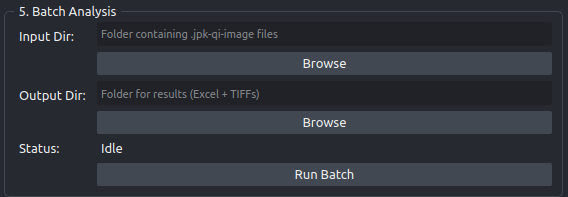

# 5 - Batch analysis

Runs the whole pipeline, load then upsample then segment then measure, over every scan in a folder, and writes one consolidated workbook plus per-image TIFFs. It has no settings of its own beyond the two folders, so panels 2 and 3 have to be right before you start.



## Configure panels 2 and 3 first

When you press **Run Batch**, the plugin reads these values from the panels above and uses them for every image in the folder:

| From panel 2 | From panel 3 |
|---|---|
| Method (`CLAHE (CPU)`, `HAT`, `SwinIR`) | CP Model |
| Factor (used only for CLAHE) | Diameter |
| Clip Limit, Unsharp Radius, Unsharp Amount | Cellprob Thresh |
| DL Model, Engine, container path | Flow Thresh |
| Apply Post-DL Sharpening | |

!!! tip "Test on one image first"

    Run panels 1 to 4 on a single representative scan and look at the mask in the 4-pane grid. A batch run repeats whatever those settings do, good or bad, across the whole folder, and a Cellpose threshold that is slightly wrong costs you the entire run.

Unlike the interactive path, batch captures these settings once at launch, so changing a dropdown while it runs has no effect on the results.

## Running it

1. **Input Dir**: press **Browse** and pick the folder holding your scans, or type the path.
2. **Output Dir**: press **Browse** and pick where results should be written. The folder is created if it does not exist.
3. Press **Run Batch**.

The **Status** label starts at `Idle` and then shows the current image:

```text
Processing 3/10: sample.jpk-qi-image
```

When it finishes, the status reads `Complete — 10 images processed.` and a dialog gives the same count together with the output path. Errors stop the run and appear in a dialog headed "Batch Error", with the status set to `Error — see details.`

The run happens in a background thread, so napari stays usable. It does not add layers to the viewer; everything goes to disk.

!!! note "Which files are picked up"

    Both `*.jpk-qi-image` and `*.jpk` are matched, then sorted and deduplicated. Only the top level of the input folder is searched, so scans in subfolders are skipped. If nothing matches you get "No .jpk-qi-image or .jpk files found in ..." and the run stops before doing any work.

## What lands in the output directory

| File | One per | Contents |
|---|---|---|
| `batch_results.xlsx` | run | Every measured fenestration from every image, one row each |
| `<image_stem>_upsampled.tif` | image | The upsampled image that was segmented |
| `<image_stem>_mask.tif` | image | The Cellpose label mask |

The workbook has the same columns as the single-image CSV, with `Image_Name` added at the front and `Porosity` at the end. Porosity is a per-image value, so it repeats identically on every row belonging to that image. Column definitions are in [Metrics](../reference/metrics.md) and the file layouts in [Outputs](../reference/outputs.md).

What the saved `_upsampled.tif` contains depends on the method you ran. With `HAT` or `SwinIR` it is float32 in physical height units, unless **Apply Post-DL Sharpening** was ticked, in which case it is uint16 normalized and carries no height information. With `CLAHE (CPU)` it is always uint16 normalized and carries no height information, because that path always ends in the same normalize-and-sharpen step. Nothing in the filename or the workbook records which. See [2 - Upsampling](step2-upsampling.md).

!!! warning "Images with no fenestrations disappear from the workbook"

    If Cellpose finds nothing in an image, that image contributes **zero rows** to `batch_results.xlsx`. It is not written as a row of zeros and it is not flagged. It is absent, while the completion dialog still counts it among the images processed.

    A genuinely zero-porosity scan and a segmentation that failed are indistinguishable in the output, because both are missing in the same way.

    **Check for this every time.** Count the distinct values in the `Image_Name` column and compare that against the number of files in your input folder. If the counts differ, open the `_mask.tif` files for the missing images: those are always written, even when empty, so you can see whether the scan really had no pores or the settings were wrong for it.

!!! warning "Rows from different images are not strictly comparable"

    Cellpose normalizes each image using its own 1st and 99th percentiles, recomputed per image. Every scan in the run is therefore segmented under its own contrast stretch, and a pore near the detection limit may be found in one image and missed in another with identical biology but different overall contrast.

    This has most effect on counts, porosity, and the lower tail of the size distribution. It cannot be turned off from the interface. Keep acquisition settings as uniform as you can across a batch, and treat between-image differences in pore count with caution. See [Known issues](../caveats/known-issues.md).

!!! note "An error part-way through loses the workbook"

    `batch_results.xlsx` is written only after the last image finishes. If any image raises an error, the run stops there and no workbook is produced, though the `_upsampled.tif` and `_mask.tif` files for the images already completed remain on disk. Fix the cause, move the finished scans aside, and re-run the rest.

## After the run

Open `batch_results.xlsx`, confirm the `Image_Name` count, and start from the per-image `Porosity` values. Before drawing conclusions from the absolute diameters, read [The scale-domain question](../caveats/scale-domain.md).
