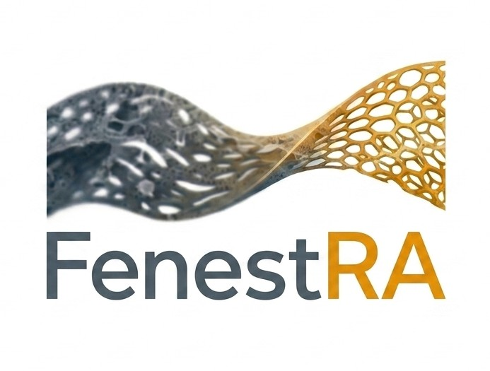
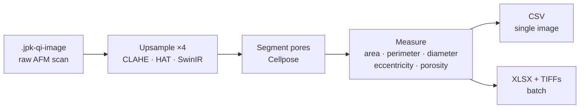
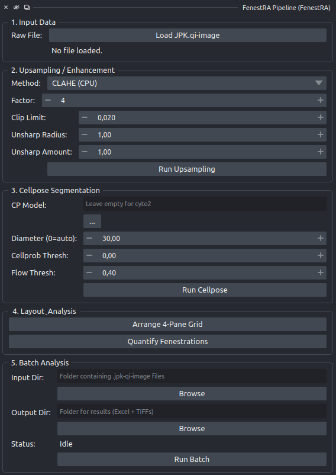

---
hide:
  - navigation
---



# FenestRA

**Fenestration Resolution & Analysis** — a [napari](https://napari.org) plugin that takes a raw
AFM scan of a liver sinusoidal endothelial cell and returns physical measurements of its
fenestrations.

[](https://pypi.org/project/napari-fenestra/)
[](https://doi.org/10.5281/zenodo.19700659)


You load a `.jpk-qi-image`, choose how to upsample it, segment the pores, and export a table of
areas, perimeters, equivalent diameters, eccentricities, and porosity — in nanometres, not pixels.
Five numbered panels, in order, top to bottom.

!!! important "Pre-publication notice"

    This repository provides the public codebase and container recipes. The fine-tuned deep
    learning weights (HAT, SwinIR, and the custom Cellpose LSEC segmentation model) are **not
    public yet**. They will be released alongside the peer-reviewed manuscript on publication.

    Until then the HAT and SwinIR methods require weights you already have. The **CLAHE (CPU)**
    method needs no weights and works today. See [Model weights](install/model-weights.md).

---

## Start here

<div class="grid cards" markdown>

- **:material-download: [Install](install/index.md)**

    Conda environment, container backend, and how to check it actually works.

- **:material-gesture-tap-button: [User guide](guide/index.md)**

    The five panels, one page each, with screenshots of the real interface.

- **:material-table: [Reference](reference/index.md)**

    Every control, every output column, and the pixel-to-nanometre arithmetic.

- **:material-alert-decagram: [Caveats & limits](caveats/index.md)**

    What the numbers do and do not support. Read before publishing anything.

</div>

---

## What it does



The scan's physical scale (nanometres per pixel) is read from the JPK file itself and carried
through to the final table, so every measurement comes out in nanometres.

Deep learning inference always runs in a **separate Python process** from napari, because the
super-resolution models depend on `basicsr`, whose pins cannot coexist with a modern napari
install. How that separation is enforced depends on how you installed:

- **Native install (conda + pip)** — a separate container (`nvcr.io/nvidia/pytorch:23.01-py3`,
  Python 3.8 / torch 1.14), engine **Singularity** or **Docker**. This is the reference stack, and
  where published numbers should come from.
- **[All-in-one image](install/all-in-one.md)** — a second virtual environment inside the same
  image, `/opt/venv-dl` (Python 3.10, torch 2.1.2; torch 2.8.0 on the `cu128` image), engine
  **Local (bundled)**. No container is launched, because a container cannot launch a container.

See [How it works](architecture/index.md).

## Quick start

**Native install (conda + pip)** — once [installed](install/index.md):

```bash
conda activate fenestra-env
napari
```

Then **Plugins → FenestRA Pipeline**, and work down the five panels.

**[All-in-one container](install/all-in-one.md)** — run `containers\run_fenestra.bat` (Windows;
or drag a folder of scans onto it in Explorer) or `containers/run_fenestra.sh` (Linux/macOS), then
open <http://localhost:6080>. napari opens with the FenestRA dock already in place and panel 2
preset to `Local (bundled)`. There is no conda environment to activate inside the image.



For a folder of scans instead of one, skip to [Batch analysis](guide/step5-batch.md).

## Before you publish a number

Three things materially affect what the measurements mean. Each has its own page:

| | |
|---|---|
| **Acquisition scale** | The models were trained to invert a ×4 synthetic degradation from ~100 nm/px. A scan acquired much finer than that is outside the training domain, and nothing in the plugin will warn you. → [The scale-domain question](caveats/scale-domain.md) |
| **Cellpose 4 labels** | Two controls in panel 3 no longer do what their labels say, because the Cellpose API changed underneath them. → [Segmentation](guide/step3-segmentation.md) |
| **Known issues** | A short, specific list — including one that silently drops images from batch results. → [Known issues](caveats/known-issues.md) |

## Citing

If FenestRA contributes to published work, please cite the plugin and the tools it builds on.
See [Citing FenestRA](about/citing.md).

---

<div markdown>


<small>This project has received funding from the European Union's Horizon research and innovation
programme under the Marie Skłodowska-Curie grant agreement No 101119613, as part of the
[ImAge-d MSCA Doctoral Network](https://uit.no/research/image-d).</small>
</div>
