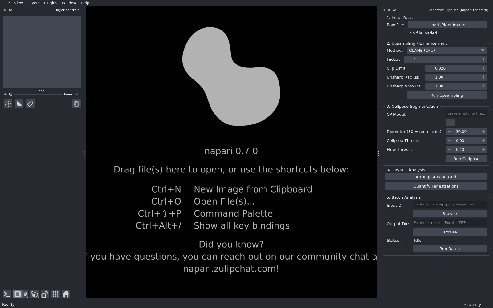

# The all-in-one container

One image. One command. Nothing installed on Windows except Docker Desktop.

This is the recommended route on **Windows and macOS**, and it exists because the step-by-step
install asks a biologist to assemble seven things that can each fail independently: Anaconda, a Qt
binding, a CUDA build of PyTorch, Cellpose, Git, the plugin, and a *second* container for the
deep-learning backend. Every one of those has produced a real support ticket.

Inside this image, none of them run on Windows at all.

## What it removes

| Failure you would otherwise hit | Why it cannot happen here |
|---|---|
| `qtpy.QtBindingsNotFoundError: No Qt bindings could be found` | Qt runs on Linux inside the image, against a pinned PyQt6 6.11.0 |
| `ImportError: DLL load failed while importing QtWidgets` | No Windows DLLs are involved |
| `DLL load failed ...: application control policies have blocked this file` | The `.so` files live on the container's filesystem, which AppLocker and WDAC do not police |
| `ERROR: Cannot find command 'git'` | `AFMReader` is installed from PyPI, so Git is no longer needed |
| `can't open file '/opt/python'` | There is no second container to launch |
| CPU-only PyTorch installed by accident | The CUDA build is baked in and checked at build time |
| Cellpose downloading 1.15 GB on first use | `cpsam` ships inside the image |

## Requirements

- **Docker Desktop**, with the **WSL 2 backend** on Windows.
- **An NVIDIA GPU and a current driver** for the deep-learning methods. Docker Desktop exposes it
  through `--gpus all`, which the launcher passes for you.
- **About 17 GB of disk** for the image, plus room for your data. The built image measured
  16.3 GB on 18 September 2026; most of it is two independent CUDA PyTorch stacks that cannot
  share anything, plus the 1.15 GB Cellpose model.

!!! warning "macOS has no GPU path"

    Docker Desktop for macOS has no NVIDIA passthrough. FenestRA will start and the CLAHE (CPU)
    upsampling method works, but HAT and SwinIR cannot run and Cellpose falls back to the CPU,
    which means minutes per image rather than seconds. The launcher says so at startup instead of
    letting you discover it from the clock.

## Build it, once

The image is not on Docker Hub. You build it yourself:

=== "Windows"

    ```bat
    git clone https://github.com/LIVR-VUB/FenestRA.git
    cd FenestRA
    docker build -t livrvub/fenestra:latest -f containers\Dockerfile.allinone .
    ```

=== "Linux / macOS"

    ```bash
    git clone https://github.com/LIVR-VUB/FenestRA.git
    cd FenestRA
    docker build -t livrvub/fenestra:latest -f containers/Dockerfile.allinone .
    ```

It downloads several gigabytes and takes a while. You do it once.

The build is deliberately noisy about its own assumptions: it fails rather than completes if the
Qt xcb plugin cannot load, if `basicsr` cannot be imported, if the pinned HAT checkout does not
contain the `HAT` class, or if the Cellpose weights arrive truncated. A green build is therefore
worth something.

!!! bug "Linux: if Docker is installed from snap"

    The Canonical `docker` snap is confined and **cannot read `/media` or `/mnt` at all**. Building
    from a repository on an external or secondary drive fails with an empty context:

    ```
    #1 transferring dockerfile: 2B done
    ERROR: failed to solve: failed to read dockerfile: open Dockerfile.allinone: no such file or directory
    ```

    The file is right there; the daemon simply cannot see it. Either grant the interface:

    ```bash
    sudo snap connect docker:removable-media
    ```

    or clone the repository somewhere under your home directory and build from there.

## Run it

=== "Windows"

    Double-click `containers\run_fenestra.bat`.

=== "Linux / macOS"

    ```bash
    containers/run_fenestra.sh
    ```

Then open **<http://localhost:6080>** in any browser. napari appears with the FenestRA dock
already open:



That screenshot is the real thing, captured from the running image on 18 September 2026 — not a
mock-up. Note that it shows the CPU-only case: no `.jpk` is loaded and no GPU was attached.

The launcher creates two folders on your machine and mounts them:

| On your machine | Inside FenestRA | For |
|---|---|---|
| `%USERPROFILE%\FenestRA\data` / `~/FenestRA/data` | `/data` | your `.jpk-qi-image` scans and your results |
| `%USERPROFILE%\FenestRA\models` / `~/FenestRA/models` | `/models` | your `.pth` checkpoints |

Anything you save outside those two folders lives inside the container and **disappears when you
close it**. Save your CSV and your batch output under `/data`.

!!! danger "Do not publish the port to the network"

    The launchers publish the desktop as `-p 127.0.0.1:6080:6080`, which means *this machine only*.

    If you change that to `-p 6080:6080` — the form most Docker tutorials show — Docker binds
    **every** network interface. Anyone on the same office LAN, conference wifi or hotel network
    can then open `http://your-machine:6080` and get a fully interactive napari session, including
    a file dialog that can browse every folder you mounted. VNC carries no encryption, so a
    password does not fix it either. There is no error and no warning; it simply works, for them.

    Set `VNC_PASSWORD` if you want a second layer, but the loopback publish is the actual control.

## Model weights are not included

The image ships the *architecture*, not the *checkpoints*. Put your `.pth` files in the mounted
`models` folder; the DL Model field is pre-filled with `/models/best_model_ema.pth`.

Until the manuscript is published, the trained weights are not distributed. See
[Model weights](model-weights.md).

## How it works, and the one thing to know about it

FenestRA needs two Python environments that cannot be merged. The GUI needs napari, Qt 6 and
Cellpose 4 on a modern NumPy. The super-resolution backend needs `basicsr`, which still imports
`torchvision.transforms.functional_tensor` — a module deleted in torchvision 0.17 — so it is
pinned to an older pair.

Until now that separation was enforced by running the DL step in a **second container**. That is
exactly what stops working once the plugin itself is containerised: you cannot launch a container
from inside a container.

So the separation moved inside the image. Two virtual environments, one filesystem:

```
/opt/venv-gui   napari 0.7 · PyQt6 6.11 · torch 2.4 / cu124 · Cellpose 4.1.1 · AFMReader
/opt/venv-dl    torch 2.1.2 · torchvision 0.16.2 · basicsr 1.4.2 · HAT · SwinIR
```

The plugin's new **Local (bundled)** engine runs

```
/opt/venv-dl/bin/python .../fenestra/backend/inference.py --input ... --output ...
```

as an ordinary subprocess. Same process boundary, same isolation, no nesting. `PYTHONPATH` and
`PYTHONHOME` are stripped from that subprocess so the GUI environment's NumPy and PyTorch cannot
leak into the deep-learning interpreter.

!!! warning "This is not the reference stack, and that matters for publication"

    The validated backend — the one `containers/dl_upsampling.def` still builds, and the one the
    method was developed against — is **torch 1.14** on `nvcr.io/nvidia/pytorch:23.01-py3`.

    This image runs **torch 2.1.2** instead, because the torch 1.13/1.14 wheels are compiled for
    sm_37 through sm_86 with no PTX fallback: they do not start at all on an RTX 40-series card,
    an H100, or anything newer. Pinning the reference version would have made the image unusable
    on most GPUs bought after 2022.

    The architectures, the weights and the arithmetic are identical, but the two stacks are not
    bit-for-bit equivalent. **Numbers intended for publication should be produced with the
    reference container**; this image is for getting a working screen in front of a biologist.

## Adjusting the window

The desktop is a fixed-size X display, scaled to fit your browser. If text looks soft, match it to
your monitor:

```bash
docker run ... -e SCREEN=1920x1080x24 livrvub/fenestra:latest
```

## When something is wrong

Read the terminal the launcher opened. It states, before napari starts, whether a GPU was found
and whether `/models` is empty — the two things that otherwise fail quietly much later.

More symptoms, indexed by error message, on the
[Troubleshooting](../caveats/troubleshooting.md) page.
